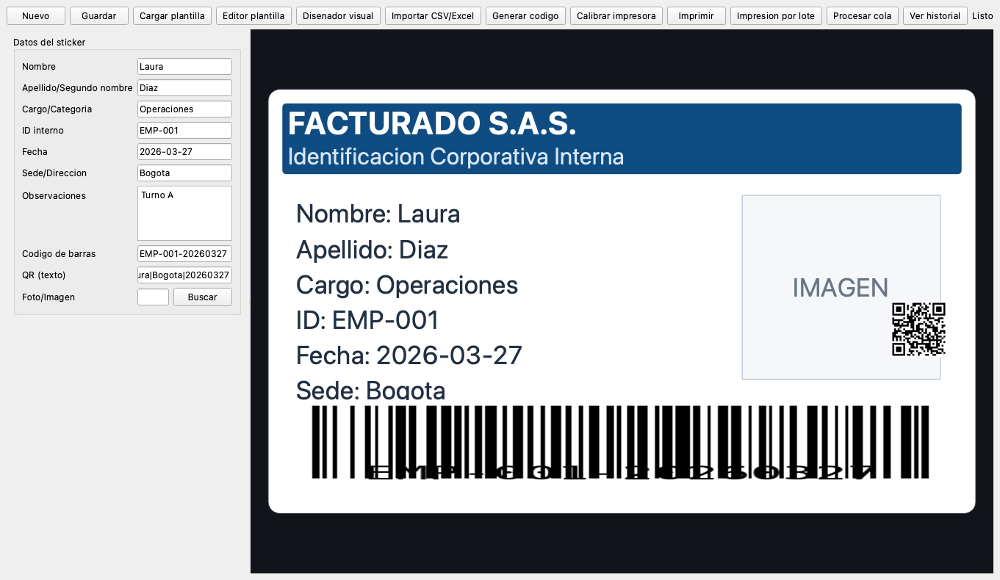

# Facturado Sticker Studio

Aplicacion de escritorio para diseno e impresion de stickers corporativos internos en Honeywell PC42t Plus, sin BarTender.

## Descarga directa (Windows)

- Releases: [https://github.com/trececlub/facturado/releases](https://github.com/trececlub/facturado/releases)
- Ultimo ZIP portable: [FacturadoStickerStudio-windows.zip](https://github.com/trececlub/facturado/releases/latest/download/FacturadoStickerStudio-windows.zip)
- Ultimo instalador: [FacturadoStickerStudio-Setup.exe](https://github.com/trececlub/facturado/releases/latest/download/FacturadoStickerStudio-Setup.exe)

## Screenshot



## Cumplimiento y uso permitido

- Uso exclusivo corporativo interno (activos, inventario, acceso interno).
- No incluye ni promueve imitacion de documentos oficiales/gubernamentales.
- Plantillas visuales con estilo corporativo neutro.

## Funcionalidades implementadas

- Formulario de captura de datos + preview en tiempo real.
- Plantillas JSON parametrizadas (posiciones, tamanos, fuentes, codigos).
- Editor numerico de plantilla y disenador visual drag-and-drop.
- Barcode + QR en preview e impresion.
- Impresion de imagen/foto real en ZPL mediante `^GFA` (mono).
- Importacion CSV/Excel + impresion por lote.
- Cola de impresion con reintentos y estados (`queued`, `retry`, `sent`, `failed`).
- Calibracion de impresora (darkness, speed, offsets, test print).
- Historial con auditoria (usuario, host, impresora, hash ZPL, queue id).
- Exportacion de copias `.zpl` para trazabilidad.

## Arquitectura

- `ui/`: ventanas, formularios, preview, calibracion y disenador.
- `templates/`: plantillas corporativas JSON.
- `printer/print_engine.py`: mapeo datos -> ZPL.
- `printer/printer_service.py`: envio RAW USB (Windows) o red (TCP 9100).
- `printer/queue_service.py`: cola, reintentos y estados.
- `data/`: historial, registros, cola y exports ZPL.
- `utils/`: importacion, validaciones, codigos y conversion imagen->GFA.

## Requisitos

- Windows 10/11 recomendado para impresion USB RAW.
- Python 3.11+ para desarrollo.
- Honeywell PC42t Plus en emulacion ZPL/ZSim (segun firmware).

## Ejecucion en desarrollo

```bash
python -m venv .venv
# PowerShell
.venv\Scripts\Activate.ps1
pip install -r requirements.txt
python main.py
```

## Configuracion de impresora

Editar `config/app_config.json`:

```json
{
  "printer": {
    "interface": "usb",
    "default_name": "Honeywell PC42t Plus",
    "network_host": "",
    "network_port": 9100,
    "darkness": 15,
    "speed": 3,
    "offset_x_mm": 0,
    "offset_y_mm": 0,
    "retries": 2,
    "retry_delay_sec": 1.0,
    "simulate_only": false
  }
}
```

## Uso rapido

1. Cargar datos manuales o importar CSV/Excel.
2. Ajustar plantilla (editor numerico o disenador visual).
3. Ejecutar `Generar codigo`.
4. Opcional: `Calibrar impresora` y hacer test.
5. `Imprimir` o `Impresion por lote`.
6. Revisar `Procesar cola` e historial.

## Salidas y auditoria

- Registros: `data/records.json`
- Historial: `data/print_history.json`
- Cola: `data/print_queue.json`
- ZPL exportado: `data/zpl_exports/*.zpl`

## Tests

```bash
pip install -r requirements-dev.txt
python -m pytest -q
```

## CI/CD para descargables

Workflow: `.github/workflows/windows-release.yml`

- Compila `.exe` con PyInstaller.
- Crea ZIP portable.
- Genera instalador Inno Setup.
- Adjunta ambos al Release al publicar tags `v*`.

Publicar una version:

```bash
git tag v1.0.2
git push origin v1.0.2
```
